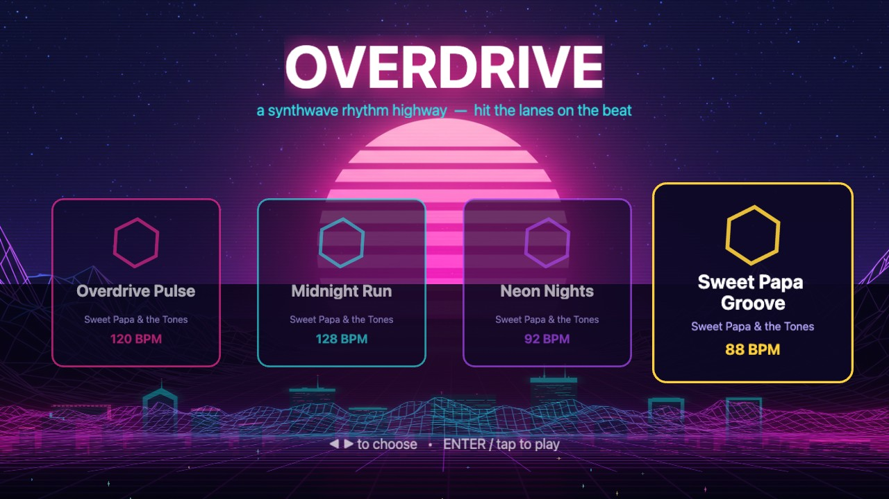
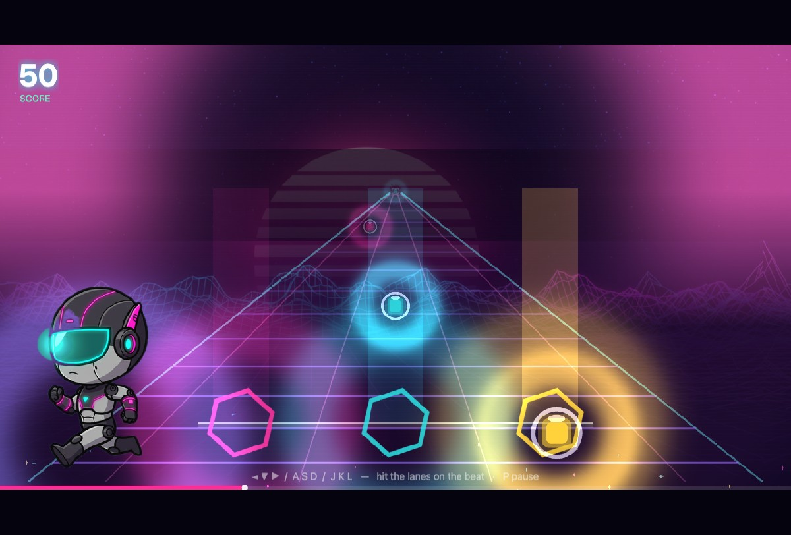

# OVERDRIVE

A **synthwave rhythm highway** built on your own tracks. Notes rush toward you
down a neon perspective road — strike them in time across **three lanes** (the
left / centre / right of the highway), chain holds, build combo, and make the
world pulse. Casual-first: missing never kills you — it just scores lower and
breaks your combo.

Engine: **Phaser 3 + TypeScript + Vite**. Deterministic core: **framework-free TS**,
test-driven via the FoFo Agentic SDLC loop. Art + music: **generated on Vertex AI**
(Imagen 3 backgrounds, Gemini 2.5 Flash Image mascot frames, Lyria music).

> Recycled from *In the Pocket*: the entire pure, unit-tested core
> (`timing` / `scoring` / `beatmap` / `run` / `AudioEngine`) is untouched — only
> the presentation and gameplay shell were rebuilt into the lane highway. The
> beat-map schema gained one backward-compatible optional field (`dur`) for holds.




## Run it

```bash
npm install
npm run dev        # http://localhost:5173
npm test           # vitest — the deterministic core suite
npm run build      # typecheck + production build to dist/
```

Controls: lanes are **◄ ▼ ►** / **A S D** / **J K L** (left / centre / right),
**P** pause, **M** mute metronome. Touch: left / middle / right thirds of the
screen. Hold a lane through a sustain note for bonus.

## Architecture

The whole game is a thin Phaser shell over a **pure, unit-tested core**. All timing
reads from `AudioContext.currentTime` (never `Date.now` / frame delta).

```
src/
  core/            # ZERO Phaser imports — fully unit-tested (Vitest)
    timing.ts      # beatTime, judgment windows, nearest-beat, injectable clock
    scoring.ts     # base points, combo, multiplier tiers, accuracy, grade
    beatmap.ts     # schema validation, ordering/dedupe, spawn lead
    run.ts         # lifecycle state machine + drift-free pause/resume clock
  audio/AudioEngine.ts   # Web Audio: track playback, beat-locked metronome, SFX
  game/            # config, track catalogue, reusable neon FX
  scenes/          # Boot, TrackSelect, Play, Results
maps/  (served from public/maps)   # *.beatmap.json
assets/ (served from public/assets) # tracks/, sprites/
tools/             # Vertex AI asset + beatmap generators
```

Add a song: drop an `.ogg` in `public/assets/tracks/`, author a
`public/maps/*.beatmap.json`, and add an entry to `src/game/tracks.ts`.

## Built with the FoFo Agentic SDLC

The deterministic core was built test-first with separated authorship:

- **Spec → `spec-lint`** (Phase 0): `in-the-pocket-spec.md` carries 15 `REQ-*` IDs
  with acceptance criteria.
- **Judge** (spec-only subagent) wrote `TEST-REQS.yaml` + the Vitest suite **before**
  any implementation existed — red for the right reason.
- **Author** (separate context) implemented the core to green, never editing the tests.
- **Referee** gate scripts graded code *and* tests: `trace-gate` (15/15 traced),
  `redgreen-gate`, `intent-gate` (no assertion-free/trivial tests).
- **Fresh-eyes reviewer** (third context) checked for cheating, correctness, and
  spec drift; its findings drove a test-hardening pass.

See `policy.json`, `gates.config`, `TEST-REQS.yaml`, `PROVENANCE.yaml`.

### Open Operator decisions (escalations)

- **`REQ-SCORE-05` "weighted" accuracy** — the spec says *weighted* but gives an
  *unweighted* formula. Shipped unweighted (matches the literal formula and the
  casual-first pillar). Change `accuracy()` + its tests if weighting is intended.
- **Phaser version** — spec says Phaser 4; shipped on the current stable **Phaser 3.90**
  (identical scene/audio API for everything used here).

## Regenerating assets (Vertex AI)

Requires a GCP project with Vertex AI enabled and `gcloud` auth:

```bash
VERTEX_PROJECT=<your-project> python3 tools/generate_overdrive_assets.py all  # Imagen sky/ridge/city + Lyria tracks
VERTEX_PROJECT=<your-project> python3 tools/generate_hero_anim.py             # Gemini mascot frames
python3 tools/make_overdrive_maps.py                                         # author lane charts (with holds)
```

The original *In the Pocket* generators (`generate_assets.py`, `make_beatmaps.py`)
are kept for provenance.
