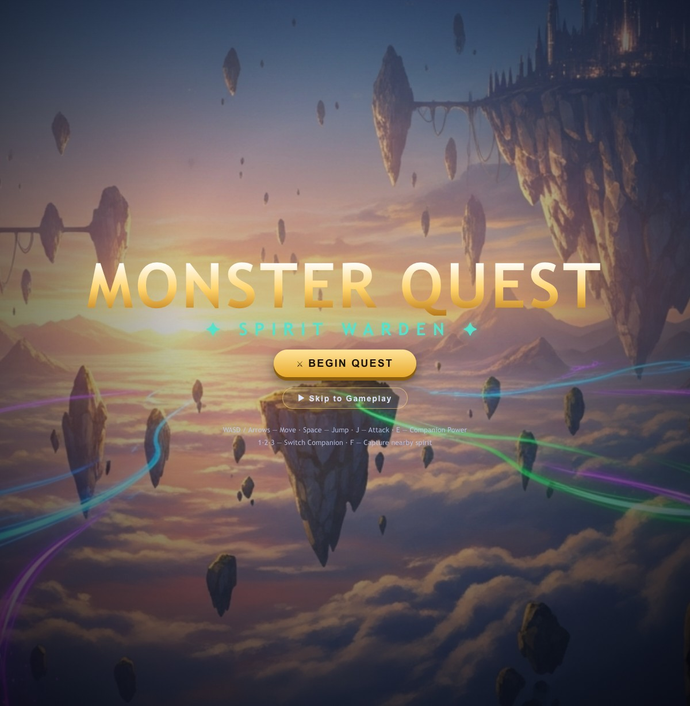

# 🗡️ Monster Quest — Spirit Warden

A **visually stunning 3D action-adventure** that fuses three beloved genres:

- **Zelda‑style** top‑down exploration of a hand‑crafted world
- **Mario‑style** physics platforming (jump across a lava chasm on floating platforms)
- **Pokémon‑style** companion system — capture elemental spirits, switch between them, and use their powers to fight and solve puzzles

Built with **Three.js** (3D rendering, dynamic shadows, **bloom** post‑processing) and a fully custom game engine. Every visual asset, music track, and voice‑over was generated with the **AssetForge** pipeline (Google Vertex AI: Imagen 4, Lyria, Gemini TTS).



## ▶️ How to run

No build step required — it's pure ES modules.

```bash
cd monster-quest
python3 -m http.server 8842
# open http://localhost:8842
```

> Three.js loads from a CDN via an import‑map, so the first run needs an internet
> connection. Post‑processing degrades gracefully if the addons can't be fetched.

## 🎮 Controls

| Key | Action |
|-----|--------|
| **WASD / Arrows** | Move (top‑down) |
| **Space** | Jump |
| **J** | Sword attack |
| **E** | Use active companion's elemental power |
| **F** | Capture a nearby wild spirit |
| **1 · 2 · 3** | Switch active companion |

## 🌟 The adventure (a complete vertical slice)

1. **Cinematic opening** — narrated three‑beat cutscene sets up the world and story.
2. **The Meadow** — meet the **Spirit Sage**, gather crystals, and **capture Ember**, the fire spirit.
3. **The Chasm** — platform across floating wooden islands over molten lava.
4. **The Temple Courtyard** — solve the **brazier puzzle** by shooting Ember's flame into three braziers to open the Shadow Gate. (Aqua and Sprout spirits can also be captured here.)
5. **Boss battle** — face the **Shadow King** across **three escalating phases** (projectile volleys, expanding shockwaves, summoned shadow minions).
6. **Victory cutscene** and end screen.

## 🧩 Architecture

| File | Responsibility |
|------|----------------|
| `src/main.js` | Game state machine, main loop, all interaction logic |
| `src/engine.js` | Three.js setup, camera, lighting, bloom, billboards, particles, input |
| `src/world.js` | Level geometry, collision data, interactables |
| `src/player.js` | 3D platformer physics, combat, health, respawn |
| `src/companion.js` | Capture, roster, summoning, elemental projectiles |
| `src/boss.js` | Shadow King AI, phases, minions |
| `src/ui.js` | HUD, hearts, roster, dialogue, boss bar, banners, fades |
| `src/cutscene.js` | Cinematic image + narration sequences |
| `src/audio.js` | Music streaming + procedural WebAudio SFX |
| `src/assets.js` | Asset manifest + loader with procedural fallbacks |

Characters, spirits, and items are rendered as **billboarded sprites** in a true 3D
world — combining painterly AI art with real‑time 3D lighting, shadows, and bloom.

## 🛠️ Asset pipeline

All assets live in `assets/` and were produced by the scripts in `tools/`:

- `gen-assets.sh` — drives the `assetforge` CLI to generate every sprite, texture,
  cutscene still, music track, and narration line.
- `chromakey.py` / `despill.py` / `hero_fix.py` — clean the chroma‑green key from
  generated sprites for crisp transparent cut‑outs.

Re‑generate everything with `bash tools/gen-assets.sh` (requires the AssetForge CLI).

---

*Made as a standalone game alongside "In the Pocket" — the original project is untouched.*
